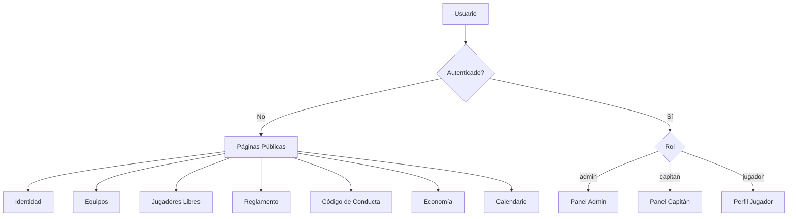
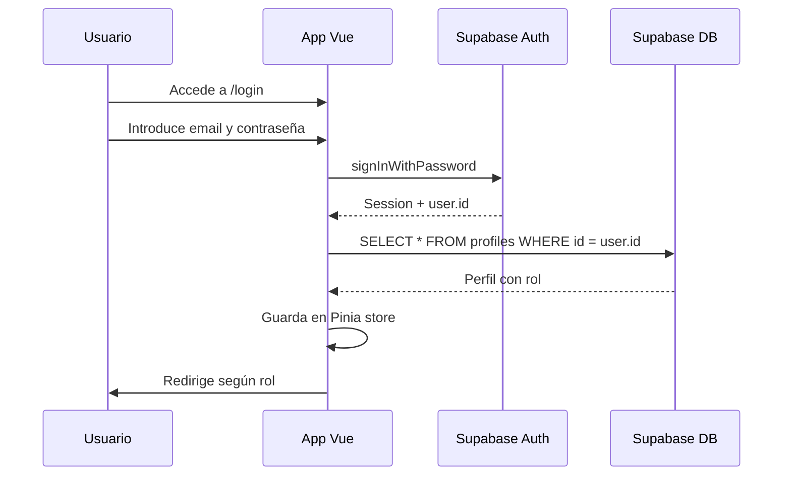

# Plan de Desarrollo: FutSal La Vall

## Stack Tecnológico

| Capa       | Tecnología                   |
| ---------- | ---------------------------- |
| Frontend   | Vue 3 + Vite                 |
| Estilos    | Tailwind CSS                 |
| Estado     | Pinia                        |
| Routing    | Vue Router 4                 |
| Backend    | Supabase (PostgreSQL + Auth) |
| Gráficos   | Chart.js + vue-chartjs       |
| Calendario | vue-cal o FullCalendar       |
| Iconos     | Heroicons o Lucide Vue       |

---

## Paleta de Colores

```
Primario:   #164bf0  (Azul FutSal)
Secundario: #f6ec15  (Amarillo FutSal)
Terciario:  #708cc5  (Azul claro)
Fondo:      #f8f9fa  (Gris muy claro, estilo Notion)
Texto:      #1a1a2e  (Casi negro)
```

---

## Arquitectura de la Aplicación



---

## Estructura de Base de Datos (Supabase)

### Tabla: `profiles`

| Campo           | Tipo                        | Descripción                           |
| --------------- | --------------------------- | ------------------------------------- |
| id              | uuid (FK auth.users)        | ID del usuario                        |
| nombre          | text                        | Nombre completo                       |
| rol             | enum: admin/capitan/jugador | Rol del usuario                       |
| equipo_id       | uuid (FK equipos)           | Equipo al que pertenece               |
| posicion        | text                        | Posición en el campo                  |
| numero_camiseta | int                         | Número de camiseta                    |
| foto_url        | text                        | URL de foto de perfil                 |
| libre           | boolean                     | Si está disponible como jugador libre |
| created_at      | timestamp                   | Fecha de registro                     |

### Tabla: `equipos`

| Campo            | Tipo               | Descripción        |
| ---------------- | ------------------ | ------------------ |
| id               | uuid               | ID del equipo      |
| nombre           | text               | Nombre del equipo  |
| escudo_url       | text               | URL del escudo     |
| capitan_id       | uuid (FK profiles) | Capitán del equipo |
| color_principal  | text               | Color principal    |
| color_secundario | text               | Color secundario   |
| created_at       | timestamp          | Fecha de creación  |

### Tabla: `partidos`

| Campo               | Tipo                              | Descripción                |
| ------------------- | --------------------------------- | -------------------------- |
| id                  | uuid                              | ID del partido             |
| equipo_local_id     | uuid (FK equipos)                 | Equipo local               |
| equipo_visitante_id | uuid (FK equipos)                 | Equipo visitante           |
| fecha               | timestamp                         | Fecha y hora del partido   |
| lugar               | text                              | Lugar del partido          |
| goles_local         | int                               | Goles del equipo local     |
| goles_visitante     | int                               | Goles del equipo visitante |
| estado              | enum: programado/jugado/cancelado | Estado del partido         |

### Tabla: `gastos`

| Campo     | Tipo               | Descripción                 |
| --------- | ------------------ | --------------------------- |
| id        | uuid               | ID del gasto                |
| concepto  | text               | Descripción del gasto       |
| importe   | decimal            | Importe en euros            |
| categoria | text               | Categoría del gasto         |
| fecha     | date               | Fecha del gasto             |
| admin_id  | uuid (FK profiles) | Admin que registró el gasto |

### Tabla: `solicitudes_fichaje`

| Campo      | Tipo                               | Descripción            |
| ---------- | ---------------------------------- | ---------------------- |
| id         | uuid                               | ID de la solicitud     |
| jugador_id | uuid (FK profiles)                 | Jugador que solicita   |
| equipo_id  | uuid (FK equipos)                  | Equipo al que solicita |
| estado     | enum: pendiente/aceptada/rechazada | Estado                 |
| created_at | timestamp                          | Fecha de solicitud     |

---

## Estructura de Archivos del Proyecto

```
futsal_app/
├── public/
│   └── logo.svg
├── src/
│   ├── assets/
│   │   └── styles/
│   │       └── main.css          # Tailwind imports
│   ├── components/
│   │   ├── layout/
│   │   │   ├── Navbar.vue
│   │   │   ├── Footer.vue
│   │   │   └── Sidebar.vue       # Para paneles admin/capitán
│   │   ├── ui/
│   │   │   ├── Button.vue
│   │   │   ├── Card.vue
│   │   │   ├── Badge.vue
│   │   │   ├── Modal.vue
│   │   │   └── Avatar.vue
│   │   ├── equipos/
│   │   │   ├── EquipoCard.vue
│   │   │   └── EquipoForm.vue
│   │   ├── jugadores/
│   │   │   ├── JugadorCard.vue
│   │   │   └── JugadorForm.vue
│   │   ├── calendario/
│   │   │   └── CalendarioPartidos.vue
│   │   └── economia/
│   │       └── GastoChart.vue
│   ├── pages/
│   │   ├── public/
│   │   │   ├── IdentidadPage.vue
│   │   │   ├── EquiposPage.vue
│   │   │   ├── JugadoresLibresPage.vue
│   │   │   ├── ReglamentoPage.vue
│   │   │   ├── CodigoConductaPage.vue
│   │   │   ├── EconomiaPage.vue
│   │   │   └── CalendarioPage.vue
│   │   ├── auth/
│   │   │   ├── LoginPage.vue
│   │   │   └── RegisterPage.vue
│   │   ├── admin/
│   │   │   ├── AdminDashboard.vue
│   │   │   ├── AdminEquipos.vue
│   │   │   ├── AdminJugadores.vue
│   │   │   ├── AdminPartidos.vue
│   │   │   ├── AdminGastos.vue
│   │   │   └── AdminCalendario.vue
│   │   ├── capitan/
│   │   │   ├── CapitanDashboard.vue
│   │   │   └── CapitanEquipo.vue
│   │   └── jugador/
│   │       └── JugadorPerfil.vue
│   ├── router/
│   │   └── index.js              # Vue Router + guards por rol
│   ├── stores/
│   │   ├── auth.js               # Pinia: autenticación y perfil
│   │   ├── equipos.js            # Pinia: datos de equipos
│   │   ├── jugadores.js          # Pinia: jugadores libres
│   │   ├── partidos.js           # Pinia: partidos y calendario
│   │   └── gastos.js             # Pinia: gastos y economía
│   ├── lib/
│   │   └── supabase.js           # Cliente Supabase
│   └── App.vue
├── tailwind.config.js
├── vite.config.js
└── package.json
```

---

## Roles y Permisos

| Acción                    | Admin | Capitán | Jugador |
| ------------------------- | ----- | ------- | ------- |
| Ver páginas públicas      | ✅    | ✅      | ✅      |
| Crear/editar equipos      | ✅    | ❌      | ❌      |
| Gestionar su equipo       | ✅    | ✅      | ❌      |
| Fichar jugadores libres   | ✅    | ✅      | ❌      |
| Solicitar unirse a equipo | ✅    | ❌      | ✅      |
| Registrar gastos          | ✅    | ❌      | ❌      |
| Crear/editar partidos     | ✅    | ❌      | ❌      |
| Gestionar calendario      | ✅    | ❌      | ❌      |
| Ver todos los perfiles    | ✅    | ✅      | ❌      |

---

## Flujo de Autenticación



---

## Diseño UI - Inspiración Notion

- **Tipografía**: Inter o Geist (limpia y moderna)
- **Espaciado**: Generoso, mucho whitespace
- **Bordes**: Redondeados suaves (rounded-lg)
- **Sombras**: Muy sutiles (shadow-sm)
- **Navbar**: Fondo blanco con borde inferior sutil, logo + navegación horizontal
- **Cards**: Fondo blanco, borde gris claro, hover con sombra suave
- **Botones primarios**: Fondo #164bf0, texto blanco
- **Badges/etiquetas**: Fondo #f6ec15 con texto oscuro para destacar
- **Modo oscuro**: Opcional en fase posterior

---

## Fases de Desarrollo

### Fase 1: Fundamentos

1. Inicializar Vue 3 + Vite + Tailwind CSS
2. Configurar Supabase (tablas + auth)
3. Configurar Vue Router + Pinia
4. Crear layout base (Navbar + Footer)

### Fase 2: Páginas Públicas

5. Identidad
6. Equipos
7. Jugadores Libres
8. Reglamento Oficial
9. Código de Conducta
10. Economía y Transparencia (con Chart.js)
11. Calendario

### Fase 3: Autenticación

12. Login / Registro
13. Guards de rutas por rol

### Fase 4: Paneles por Rol

14. Panel Administrador (CRUD completo)
15. Panel Capitán (gestión de equipo + fichajes)
16. Perfil Jugador (solicitudes de equipo)

### Fase 5: Pulido

17. Responsive design completo
18. Animaciones y transiciones
19. Testing y correcciones
